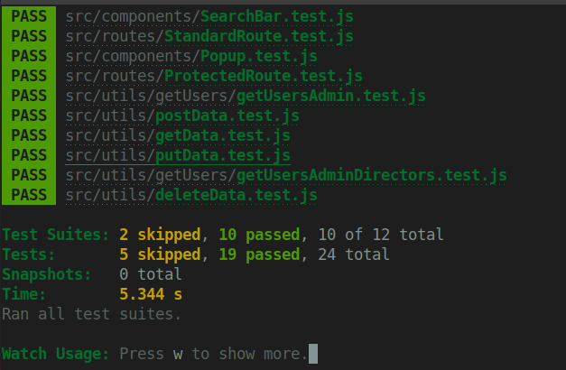
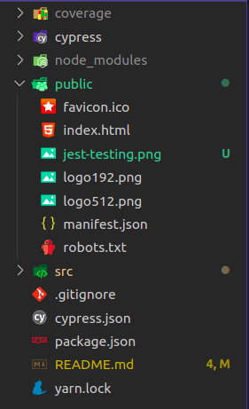
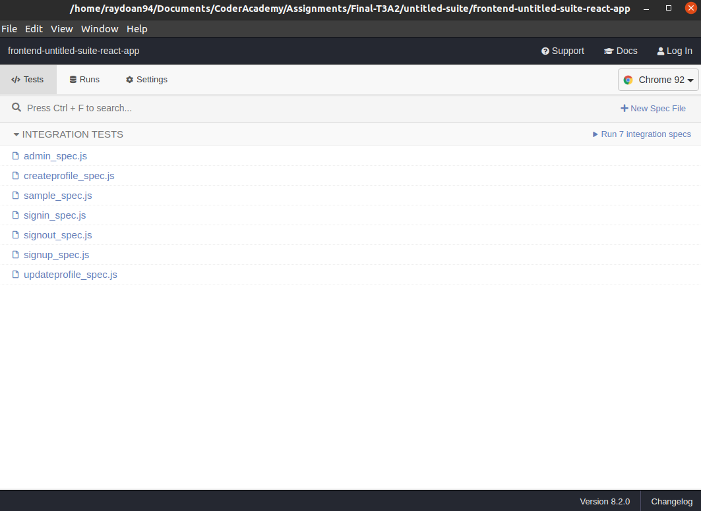
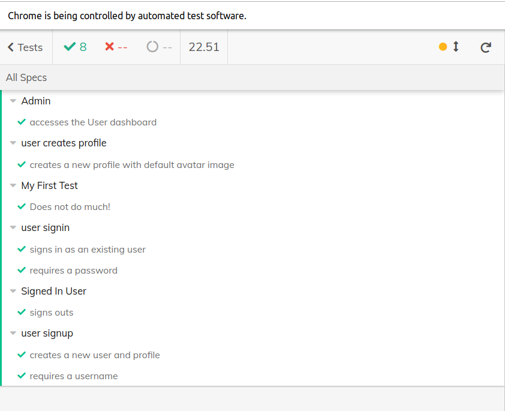
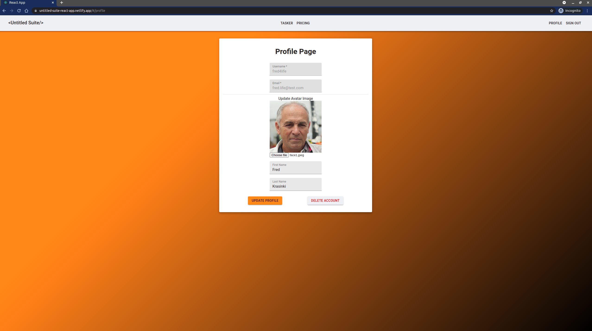
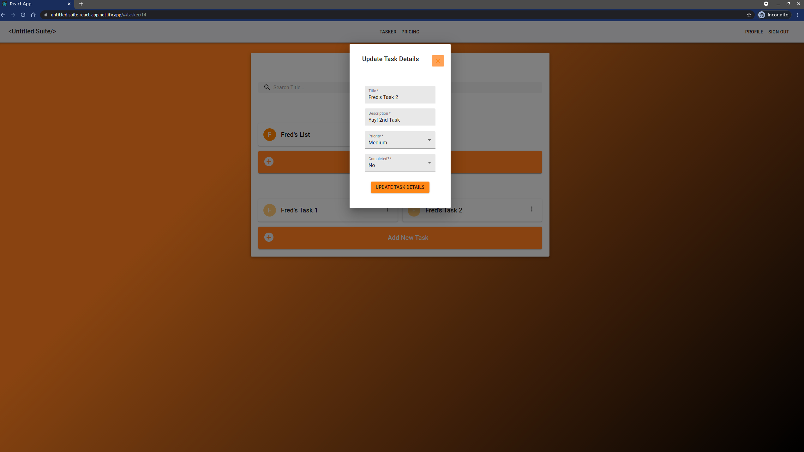
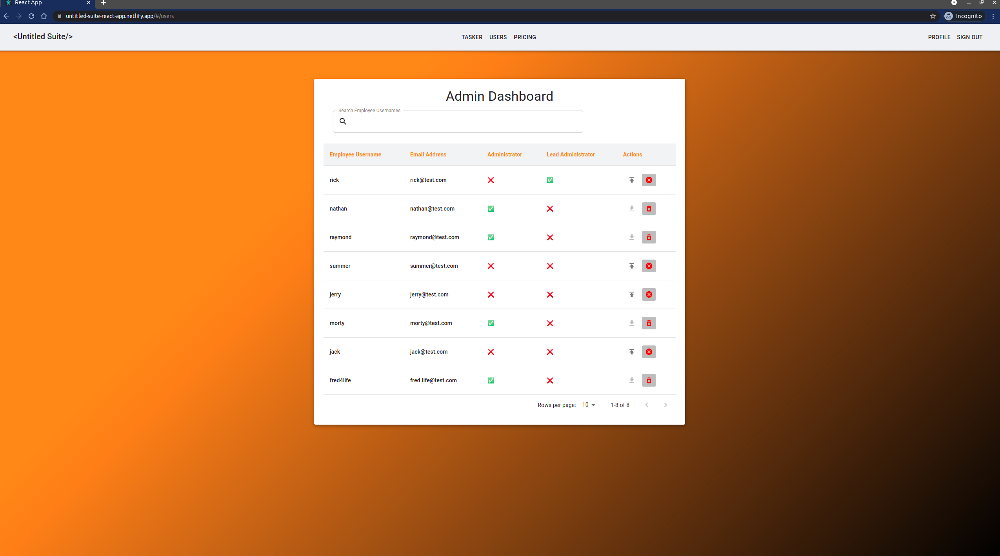

# Untitled Suite Front End App

**Untitled Suite Web Application:**

[Link to Deployed Site](https://untitled-suite-react-app.netlify.app/)

**The Schwifty Committee Repo / Source Code:**

[Link to the Organisation Repo](https://github.com/TheSchwiftyCommittee/untitled-suite)

**Front-End Repo:**

[Link to Front-End GitHub Repo](https://github.com/TheSchwiftyCommittee/untitled-suite-react-app)

**Back-End Repo:**

[Link to Back-End GitHub Repo](https://github.com/TheSchwiftyCommittee/untitled-suite-api-db)

Built by:

- Nathan Blaga [GitHub](https://github.com/NJBLAGA)
- Raymond Doan [GitHub](https://github.com/raymonddoan)

## **Instructions**

Follow the below steps to successfully install and run the front-end application of Untitled Suite.

1. Head over to the project's front-end GitHub page at `ttps://github.com/TheSchwiftyCommittee/untitled-suite-react-app`
1. Click on the green button labelled `code`
1. Copy either the `HTTPS` or `SSH link`.
1. In your terminal, head to the directory/folder of your choice (where you want to store the front-end application)
1. Type the following command `git clone xxxxxxxxxxxxx` (xxxx denoting the copied link from step 3)
1. This command will then proceed to clone the front-end repo to your local machine
1. Navigate to your local cloned copy by using `cd untitled-suite-react-app` in your terminal
1. Using `yarn install --check-files`, install the projects required dependencies.
1. Once the above command has finished, open the project using the command `code.` (if using `VS Code`) or the text editor of your choice.
1. Make sure the back-end API and server are running (following the instructions outlined in the  back-end GitHub Repo [here](https://github.com/TheSchwiftyCommittee/untitled-suite-api-db) ).
1. Once completed, run the following command: `yarn start`.

The `React Front-End` should now be running on `localhost:3000`.

Enjoy!

## **How to Run tests**

### **Unit Testing - JEST and React-Testing-Library**

1. Unit testing files are located within the same folders as the files they are testing (ie. `App.test.js` is located in the same folder as `App.js`).
1. Using `yarn install --check-files` as instructed above, all packages required for the application listed in the `package.json` file will be installed.
1. Within the same terminal, run the following command `yarn test` from the root directory of your cloned project. Note: `yarn test:coverage` can also be run to retrieve the test coverage results.
1. The terminal will then display the following in your terminal:

### **Integration/E2E Testing - Cypress**

1. For Integration/E2E Testing files, these files are located within the `/cypress` folder as show below:

1. Similar to the unit tests, once all the packages are installed using `yarn install --check-files`, run the client using `yarn start`.
1. In a different terminal, run the following command `yarn cypress:open` from the root directory of your cloned project to run cypress. The following menu will pop up:

1. Once completed, click on the button `Run integration specs` on the top right of the pop up.
1. You will be taken to a virtual Chrome browser and show the following results:

## **Live Visuals of Untitled Suite**

### **Create Profile Page:**

### **Update Task Page:**

### **Users Page: (Admin Dashboard)**

